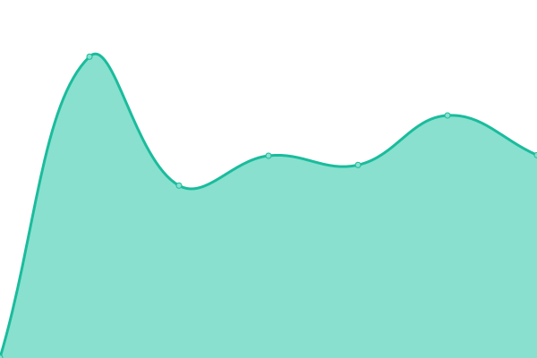
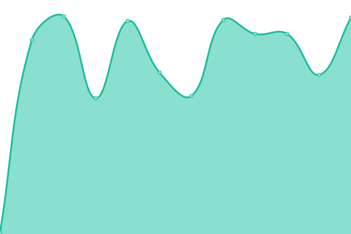
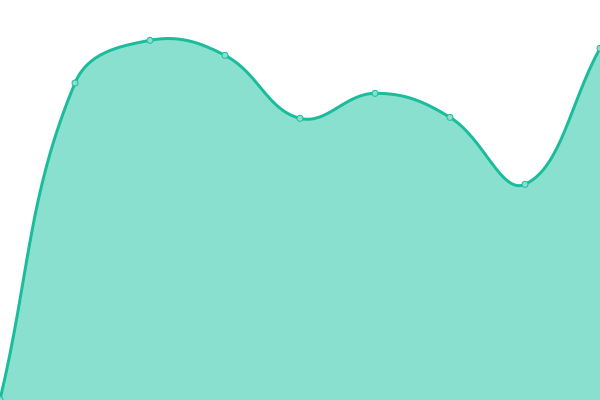
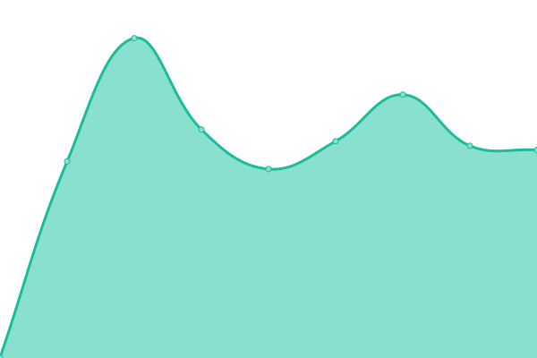
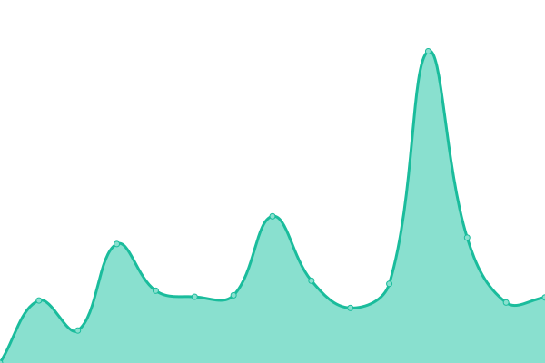
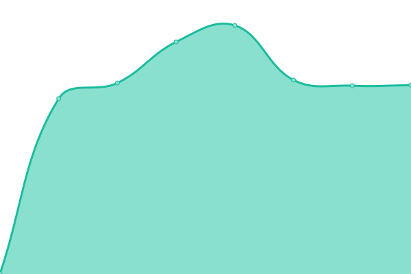

# [📈 Live Status](https://status.noleron.com): <!--live status--> **🟧 Partial outage**

This repository contains the open-source uptime monitor and status page for [нездалисько](noleron.com), powered by [Upptime](https://github.com/upptime/upptime).

With [Upptime](https://upptime.js.org), you can get your own unlimited and free uptime monitor and status page, powered entirely by a GitHub repository. We use [Issues](https://github.com/uandreew/status.noleron.com/issues) as incident reports, [Actions](https://github.com/uandreew/status.noleron.com/actions) as uptime monitors, and [Pages](https://status.noleron.com) for the status page.

<!--start: status pages-->
<!-- This summary is generated by Upptime (https://github.com/upptime/upptime) -->
<!-- Do not edit this manually, your changes will be overwritten -->
<!-- prettier-ignore -->
| URL | Status | History | Response Time | Uptime |
| --- | ------ | ------- | ------------- | ------ |
|  [OPSP](https://opulus.space) | 🟩 Up | [opsp.yml](https://github.com/crisukbot/status.noleron.com/commits/HEAD/history/opsp.yml) | 

 428ms
     
 | 

<a href="https://status.noleron.com/history/opsp">100.00%</a>
    

|  [NL WEB](https://noleron.com) | 🟩 Up | [nl-web.yml](https://github.com/crisukbot/status.noleron.com/commits/HEAD/history/nl-web.yml) | 

 637ms
     
 | 

<a href="https://status.noleron.com/history/nl-web">100.00%</a>
    

|  [NL Social](https://social.noleron.com) | 🟩 Up | [nl-social.yml](https://github.com/crisukbot/status.noleron.com/commits/HEAD/history/nl-social.yml) | 

 814ms
     
 | 

<a href="https://status.noleron.com/history/nl-social">100.00%</a>
    

|  [NL Matrix (Server)](https://noleron.com/_matrix/static/) | 🟩 Up | [nl-matrix-server.yml](https://github.com/crisukbot/status.noleron.com/commits/HEAD/history/nl-matrix-server.yml) | 

 130ms
     
 | 

<a href="https://status.noleron.com/history/nl-matrix-server">100.00%</a>
    

|  [NL Matrix (Client Element)](https://mx.noleron.com) | 🟩 Up | [nl-matrix-client-element.yml](https://github.com/crisukbot/status.noleron.com/commits/HEAD/history/nl-matrix-client-element.yml) | 

 640ms
     
 | 

<a href="https://status.noleron.com/history/nl-matrix-client-element">100.00%</a>
    

|  [NL Matrix (Client Cinny)](https://cinny.noleron.com) | 🟩 Up | [nl-matrix-client-cinny.yml](https://github.com/crisukbot/status.noleron.com/commits/HEAD/history/nl-matrix-client-cinny.yml) | 

 783ms
     
 | 

<a href="https://status.noleron.com/history/nl-matrix-client-cinny">100.00%</a>
    

|  [NL Pass](https://pass.noleron.com) | 🟩 Up | [nl-pass.yml](https://github.com/crisukbot/status.noleron.com/commits/HEAD/history/nl-pass.yml) | 

 677ms
     
 | 

<a href="https://status.noleron.com/history/nl-pass">100.00%</a>
    

|  [NL Blog](https://blog.noleron.com) | 🟥 Down | [nl-blog.yml](https://github.com/crisukbot/status.noleron.com/commits/HEAD/history/nl-blog.yml) | 

 784ms
     
 | 

<a href="https://status.noleron.com/history/nl-blog">99.80%</a>
    

|  [NL Mail](https://mail.noleron.com) | 🟥 Down | [nl-mail.yml](https://github.com/crisukbot/status.noleron.com/commits/HEAD/history/nl-mail.yml) | 

 1213ms
     
 | 

<a href="https://status.noleron.com/history/nl-mail">97.03%</a>
    

|  [NL Git](https://git.noleron.com/ihor/noleron-com) | 🟥 Down | [nl-git.yml](https://github.com/crisukbot/status.noleron.com/commits/HEAD/history/nl-git.yml) | 

 1169ms
     
 | 

<a href="https://status.noleron.com/history/nl-git">94.79%</a>
    

|  [NL Auth](https://auth.noleron.com) | 🟩 Up | [nl-auth.yml](https://github.com/crisukbot/status.noleron.com/commits/HEAD/history/nl-auth.yml) | 

 1143ms
     
 | 

<a href="https://status.noleron.com/history/nl-auth">92.53%</a>
    

|  [NL Lunarium](https://lunarium.noleron.com) | 🟥 Down | [nl-lunarium.yml](https://github.com/crisukbot/status.noleron.com/commits/HEAD/history/nl-lunarium.yml) | 

 638ms
     
 | 

<a href="https://status.noleron.com/history/nl-lunarium">89.48%</a>
    

<!--end: status pages-->

[**Visit our status website →**](https://status.noleron.com)

## 📄 License

- Powered by: [Upptime](https://github.com/upptime/upptime)
- Code: [MIT](./LICENSE) © [Anand Chowdhary](https://anandchowdhary.com), supported by [Pabio](https://pabio.com)
- Data in the `./history` directory: [Open Database License](https://opendatacommons.org/licenses/odbl/1-0/)
